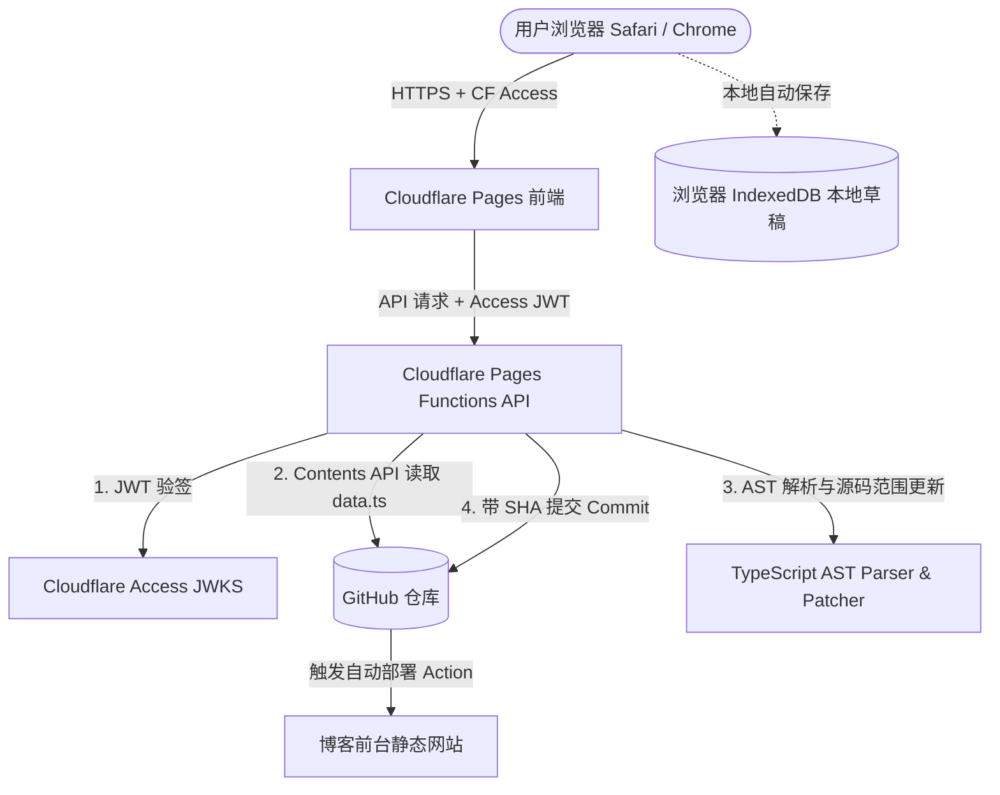

# Oblivion-CMS

**Oblivion-CMS** 是一个专为个人博客设计的独立文章/说说可视化编辑器，拥有类似 QQ 空间“发表说说”的沉浸式操作体验。

它直接托管于 **Cloudflare Pages**，基于 **Cloudflare Access** 实现无数据库的零信任身份认证，并通过 **TypeScript AST (抽象语法树)** 安全读写保存在 GitHub 仓库中的 `data.ts`（例如 `src/components/data/moments.ts`），直接触发博客既有的静态部署流程。

---

## 🌟 核心特性

- **QQ 空间式九宫格媒体管理**：
  - 三列统一正方形网格（1:1），图片视频自由混排。
  - **打破 9 个限制**：第 10 个及更多媒体自动换行（如 13 个媒体展示 5 行），编辑模式完整可见。
  - **自由拖拽排序**：支持桌面端鼠标拖拽及移动端 Safari 触屏长按拖拽，实时同步。
  - **媒体预览与大图灯箱**：支持图片全屏大图（键盘方向键、Escape 关闭）与原生视频弹层预览（关闭即停播）。
  - **多行批量粘贴导入**：支持在对话框中一次粘贴多条 URL 批量导入，智能推测媒体类型。
  - **加载容错保护**：媒体加载失败展示错误占位、重试按钮与快速修改 URL 入口，绝不让编辑器崩溃。
- **TypeScript AST 安全范围修改**：
  - **杜绝正则粗暴替换**：使用 AST 精确查找目标文章在源码中的 `[start, end]` 字符范围。
  - **极致保真**：完美保留源文件中的顶部注释、导入语句、缩进风格、字段顺序及其它无关代码。
  - **语法合法性往返校验**：每一次改动均重新解析并校验 TypeScript 语法与文章结构；若包含动态表达式（如 `Date.now()`、函数调用），明确提示并拒绝破坏性改写。
- **IndexedDB 本机防抖自动草稿**：
  - 编辑时防抖（700ms）自动保存到当前浏览器的 IndexedDB。
  - 刷新页面、意外关闭、切换文章均不丢失编辑进度。
  - “保存草稿”仅保存在本机；点击“发布到 GitHub”才提交远程仓库；发布成功自动清理对应草稿。
- **GitHub API 联机发布与冲突控制**：
  - 提交基于远程 SHA 的版本基准校验。
  - 当远程仓库在编辑期间被其他人或进程修改时，触发 **409 Conflict** 冲突保护，阻止静默覆盖，并提供本地草稿备份导出与远程最新数据合并指引。
- **Cloudflare Access 零信任服务端验签**：
  - 后端 Pages Functions 通过 Web Crypto 原生校验 `Cf-Access-Jwt-Assertion` 的 JWKS 签名、Audience、Issuer 与有效期。
  - GitHub Token 仅保存在 Cloudflare Secrets 中，严禁泄漏至前端 Bundle、Git 或接口响应。
- **全平台 Safari 与移动端体验优化**：
  - 适配 Mac、iPad、iPhone，支持 iOS 虚拟键盘与 `safe-area-inset` 安全区域。
  - 支持深色 / 浅色 / 跟随系统主题。
  - 具备 1:1 对齐博客前台样式的实时渲染预览模式。

---

## 🏗️ 架构与数据流



---

## 📦 目录结构

```text
Oblivion-CMS/
├── functions/                    # Cloudflare Pages Functions 后端 API
│   ├── api/
│   │   ├── articles.ts           # GET /api/articles (读取并 AST 解析文章)
│   │   ├── publish.ts            # POST /api/publish (新建/更新/删除文章与冲突校验)
│   │   └── auth/me.ts            # GET /api/auth/me (当前用户鉴权状态)
│   └── lib/
│       ├── access.ts             # Cloudflare Access JWT 验证 (JWKS 远程验签)
│       └── github.ts             # GitHub REST API 客户端 (UTF-8 Base64 编解码)
├── src/                          # 前端 React 源代码
│   ├── components/
│   │   ├── articles/             # 文章列表与侧边栏、筛选器
│   │   ├── media/                # QQ 空间九宫格媒体、拖拽、灯箱、批量导入
│   │   ├── music/                # 音乐卡片编辑器
│   │   ├── tags/                 # 标签管理与建议
│   │   ├── location/             # 地点输入与历史补全
│   │   ├── time/                 # 发布时间选择器 (保留秒级精度)
│   │   ├── preview/              # 博客前台 1:1 实时渲染预览
│   │   └── modals/               # 删除确认、冲突处理、系统状态弹窗
│   ├── lib/
│   │   ├── ast/                  # TypeScript AST 解析器与源码范围补丁核心
│   │   ├── api/                  # 前端 API 请求与离线降级适配器
│   │   └── storage/              # IndexedDB 本机草稿存储服务
│   ├── types/                    # TypeScript 数据模型与接口定义
│   ├── App.tsx                   # 主应用布局与交互中枢
│   └── index.css                 # Tailwind CSS 基础样式
├── tests/                        # 单元测试与集成测试
│   ├── articleParser.test.ts     # AST 解析、更新、插入、删除、往返测试
│   ├── apiAndAccess.test.ts      # Cloudflare Access 鉴权、Base64 UTF-8、API 冲突测试
│   └── frontendAndDrafts.test.ts # 前端逻辑测试 (九宫格 >9 换行、排序、指纹算法)
├── .env.example                  # 环境变量配置模板
└── vite.config.ts                # Vite 构建配置
```

---

## 🚀 本地开发与调试

### 1. 安装依赖

```bash
npm install --legacy-peer-deps --cache .npm-cache
```

### 2. 启动开发服务器

```bash
npm run dev
```

在本地开发模式（`localhost:5173`）下：
- 系统内置了**显式启用、严格限制于本地的开发模拟鉴权与离线数据引擎**。
- 您无需立即配置 GitHub Token 或 Cloudflare Access 即可体验全部功能（包括 9 宫格拖拽、批量导入、新建、编辑、删除、草稿自动保存、冲突处理演练）。

### 3. 执行自动化测试与类型检查

```bash
# 运行全部 Vitest 自动化测试
npm test

# 运行 TypeScript 类型检查
npx tsc -b

# 运行正式生产构建打包
npm run build
```

---

## ☁️ 部署到 Cloudflare Pages

### 第一步：在 GitHub 创建专属访问令牌 (GitHub Token)

1. 打开 GitHub -> Settings -> Developer Settings -> Personal access tokens -> **Fine-grained tokens**。
2. 点击 **Generate new token**：
   - **Repository access**: 选择 **Only select repositories**，选中存放文章数据的仓库（例如 `AndyCort/oblivion-dashboard`）。
   - **Permissions** -> **Repository permissions**：
     - **Contents**: 选择 **Read and write**（用于读取和提交 `data.ts`）。
3. 复制生成的 Token（格式为 `github_pat_...`）。

---

### 第二步：在 Cloudflare Pages 创建项目

1. 登录 [Cloudflare Dashboard](https://dash.cloudflare.com/)。
2. 进入 **Workers & Pages** -> **Create application** -> **Pages** -> **Connect to Git**。
3. 选择 `oblivion-cms` 仓库，构建设置如下：
   - **Framework preset**: `Vite`
   - **Build command**: `npm run build`
   - **Build output directory**: `dist`
4. 在 **Environment variables** (或部署后的 **Settings -> Environment variables**) 添加：

| 变量名 | 必填 | 说明 | 示例 |
| :--- | :---: | :--- | :--- |
| `GITHUB_OWNER` | 是 | 仓库拥有者用户名或组织名 | `AndyCort` |
| `GITHUB_REPO` | 是 | 存放文章数据的仓库名 | `oblivion-dashboard` |
| `GITHUB_BRANCH` | 是 | 分支名称（默认为 main） | `main` |
| `GITHUB_DATA_PATH` | 是 | 文章 TS 数据文件相对路径 | `src/components/data/moments.ts` |
| `GITHUB_TOKEN` | 是 | 第一步创建的 GitHub PAT (建议设为 Secret) | `github_pat_xxxx` |
| `CF_ACCESS_TEAM_DOMAIN` | 生产必填 | Cloudflare Zero Trust 团队域名 | `my-team.cloudflareaccess.com` |
| `CF_ACCESS_AUD` | 生产必填 | Cloudflare Access Application AUD 标识 | `xxxx-xxxx-xxxx` |
| `DEV_MODE` | 否 | 生产环境请留空或设为 `false` | `false` |

> ⚠️ **安全警告**：`GITHUB_TOKEN` 必须作为加密 Secret 存储在 Cloudflare 中，绝不要放入公开的环境变量或代码库中。

---

### 第三步：配置 Cloudflare Access (Zero Trust) 保护

1. 打开 [Cloudflare Zero Trust 控制台](https://one.dash.cloudflare.com/)。
2. 进入 **Access** -> **Applications** -> **Add an application** -> **Self-hosted**。
3. 填写应用信息：
   - **Application name**: `Oblivion-CMS`
   - **Application domain**: 绑定您的自定义域名（例如 `cms.yourdomain.com`）或 Pages 域名。
4. 在 **Policies** 中添加策略：
   - **Action**: `Allow`
   - **Include**: 选择 `Emails`，填入允许登录您编辑器的个人邮箱。
5. 保存后，在 Application 详情页面复制 **Application Audience (AUD) Tag**，将其填入 Cloudflare Pages 的 `CF_ACCESS_AUD` 环境变量中。
6. 将您的团队域名填入 `CF_ACCESS_TEAM_DOMAIN`。

#### 保护预览部署域名（防止绕开 Access 规则）
Cloudflare Pages 默认会为每次提交生成类似 `<hash>.pages.dev` 的预览域名。为了防止未经授权的访问通过默认 Pages 域名绕开 Access：
- 在 Cloudflare Pages 项目的 **Settings -> Access control** 中直接启用 Access 策略，或者将 Access Application 的域名通配设置为 `*.pages.dev`。

---

## 🛠️ 常见问题与排查 (FAQ)

### Q1: 提示“409 CONFLICT: 检测到版本冲突”怎么办？
- **原因**：在您打开页面到点击发布的这段时间内，远程 GitHub 仓库的 `data.ts` 文件已被其他提交修改，其最新的 SHA 与您本地编辑时的基准 SHA 不一致。
- **解决办法**：系统会自动弹出冲突处理弹窗，保护您的本地草稿不被覆盖。您可以点击“复制本地草稿 JSON 备份”，然后点击“拉取最新远程数据”，刷新后将您的新内容合并发布即可。

### Q2: 提示“无法安全修改包含动态表达式的文章”是什么原因？
- **原因**：AST 解析器检测到该文章对象中含有非静态字面量的 JavaScript 动态表达式（如 `time: Date.now()`、Spread 运算符 `...props` 或函数调用）。
- **保护机制**：为了防止破坏您的代码逻辑，Oblivion-CMS 会拒绝覆盖带有动态表达式的对象。建议将动态字段改为合法的常量值（例如具体的毫秒时间戳数字）。

### Q3: 本地草稿会同步到其他设备吗？
- **不会**。第一版草稿使用浏览器的 IndexedDB 存储，严格隔离在当前浏览器和当前设备中，不经过任何未授权的云端服务器。仅有点击“发布到 GitHub”后，内容才会同步到远程仓库。
